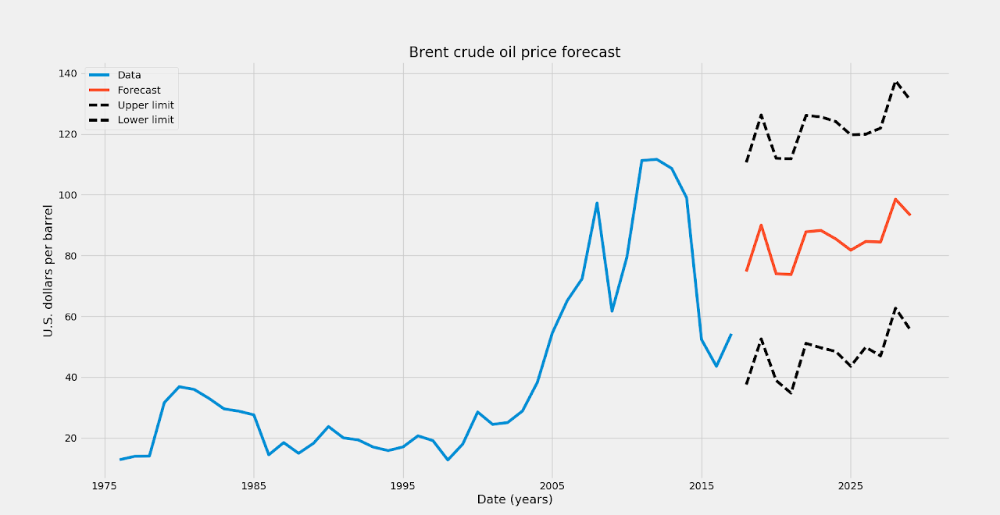

# Oil-prices-forecast

This is an example project using the fbprohet Python package for time series forecast of the average annual Brent crude oil prices.

See description and results at: https://sites.google.com/site/davidusb/projects/oil-prices-forecast

